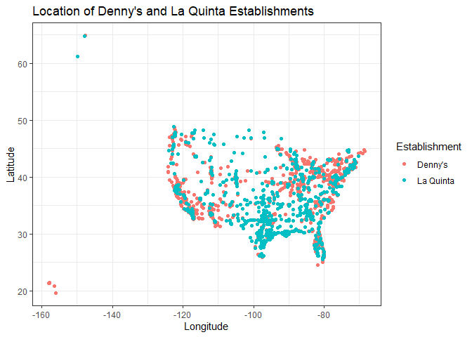
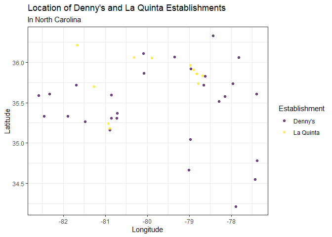
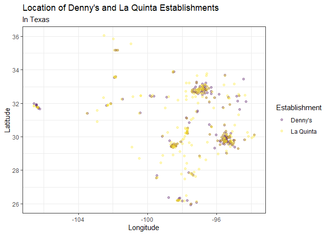
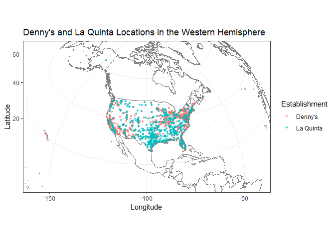

Lab 04 - La Quinta is Spanish for next to Denny’s, Pt. 1
================
Tsion
02-08-2026

### Load packages and data

``` r
library(tidyverse) 
library(dsbox) 
```

\*Install dsbox first

``` r
#manually downloaded and opened the two datasets.
```

``` r
states <- read_csv("data/states.csv")
```

``` r
dn <- dennys
lq <- laquinta
```

### Exercise 1

``` r
nrow(dn)
```

    ## [1] 1643

``` r
ncol(dn)
```

    ## [1] 6

The Dennys dataset contains 1643 and 6 columns. The rows represent a
Denny’s restaurant the data contains. The variables are address, city,
state, zip (code), longitude, and latitude.

### Exercise 2

``` r
nrow(lq)
```

    ## [1] 909

``` r
ncol(lq)
```

    ## [1] 6

The Laquinta dataset contains 909 and 6 columns. The rows represent a
Laquinta hotel the data contains. The variables are address, city,
state, zip (code), longitude, and latitude (same as the dennys’
dataset).

### Exercise 3

Laquinta hotels have locations in the following places outisde of US:

North America: Canada, Mexico

Asia: China

Australia & the Pacific Rim: New Zealnd

Europe: Georgia, Turkiye

Middle East: UAE (Abu Dhabi, Dubai)

South America: Colomibia, Ecuador

For Denny’s, the link only shows the U.S locations. It lists “View U.S
Locations (1257)” in the website. But our dataset contains 1643
observations so I suspected there might be locations outside the U.S
that we just can’t access through the website. But I am also not sure
why the numbers in our dataset are higher since it looks like it’s
listing the (US) states and zip codes there too.

I did a general google search, and wikipedia says, “It operates over
1,400 restaurants in the United States, Canada, México, Puerto Rico, and
several other international locations.”
(<https://en.wikipedia.org/wiki/Denny%27s>)

However, I wasn’t able to find a specific link that shows the different
Denny’s locations outside the U.S.

### Exercise 4

The first idea I had was to look at the latitude and longitude data and
filter out the places that would be outside of the U.S. But then, I took
a brief look at the dennys dataset, and it looks like most of the
abbreviations under the column “state” were US states. So, I thought
maybe looking at what distinct states are included in the data will let
me know whether we have stores outside the US (at least in the context
of our data).

So, I would use a function to list all the unique values that are
included in the “state” column of our data, and also maybe see the
counts of the distinct values as well. If the output shows all states
that are US states, I would think the data only contans US locations.

### Exercise 5

``` r
dn %>%
  filter(!(state %in% states$abbreviation))
```

    ## # A tibble: 0 × 6
    ## # ℹ 6 variables: address <chr>, city <chr>, state <chr>, zip <chr>,
    ## #   longitude <dbl>, latitude <dbl>

``` r
#Filter for states that are not in states$abbreviation
```

As I suspected, there are no US locations for Denny’s in this dataset.

### Exercise 6

``` r
dn %>%
  mutate(country = "United States")
```

    ## # A tibble: 1,643 × 7
    ##    address                        city    state zip   longitude latitude country
    ##    <chr>                          <chr>   <chr> <chr>     <dbl>    <dbl> <chr>  
    ##  1 2900 Denali                    Anchor… AK    99503    -150.      61.2 United…
    ##  2 3850 Debarr Road               Anchor… AK    99508    -150.      61.2 United…
    ##  3 1929 Airport Way               Fairba… AK    99701    -148.      64.8 United…
    ##  4 230 Connector Dr               Auburn  AL    36849     -85.5     32.6 United…
    ##  5 224 Daniel Payne Drive N       Birmin… AL    35207     -86.8     33.6 United…
    ##  6 900 16th St S, Commons on Gree Birmin… AL    35294     -86.8     33.5 United…
    ##  7 5931 Alabama Highway, #157     Cullman AL    35056     -86.9     34.2 United…
    ##  8 2190 Ross Clark Circle         Dothan  AL    36301     -85.4     31.2 United…
    ##  9 900 Tyson Rd                   Hope H… AL    36043     -86.4     32.2 United…
    ## 10 4874 University Drive          Huntsv… AL    35816     -86.7     34.7 United…
    ## # ℹ 1,633 more rows

``` r
#Mutate for new variable and set all observations equal to "United States".
#We don’t need to tell R how many times to repeat the character string “United States” to fill in the data for all observations, R takes care of that automatically.
```

``` r
dn <- dn %>%
  mutate(country = "United States")
```

### Exercise 7

``` r
lq %>%
  filter(!(state %in% states$abbreviation))
```

    ## # A tibble: 14 × 6
    ##    address                                  city  state zip   longitude latitude
    ##    <chr>                                    <chr> <chr> <chr>     <dbl>    <dbl>
    ##  1 Carretera Panamericana Sur KM 12         "\nA… AG    20345    -102.     21.8 
    ##  2 Av. Tulum Mza. 14 S.M. 4 Lote 2          "\nC… QR    77500     -86.8    21.2 
    ##  3 Ejercito Nacional 8211                   "Col… CH    32528    -106.     31.7 
    ##  4 Blvd. Aeropuerto 4001                    "Par… NL    66600    -100.     25.8 
    ##  5 Carrera 38 # 26-13 Avenida las Palmas c… "\nM… ANT   0500…     -75.6     6.22
    ##  6 AV. PINO SUAREZ No. 1001                 "Col… NL    64000    -100.     25.7 
    ##  7 Av. Fidel Velazquez #3000 Col. Central   "\nM… NL    64190    -100.     25.7 
    ##  8 63 King Street East                      "\nO… ON    L1H1…     -78.9    43.9 
    ##  9 Calle Las Torres-1 Colonia Reforma       "\nP… VE    93210     -97.4    20.6 
    ## 10 Blvd. Audi N. 3 Ciudad Modelo            "\nS… PU    75010     -97.8    19.2 
    ## 11 Ave. Zeta del Cochero No 407             "Col… PU    72810     -98.2    19.0 
    ## 12 Av. Benito Juarez 1230 B (Carretera 57)… "\nS… SL    78399    -101.     22.1 
    ## 13 Blvd. Fuerza Armadas                     "con… FM    11101     -87.2    14.1 
    ## 14 8640 Alexandra Rd                        "\nR… BC    V6X1…    -123.     49.2

There are 14 locations of Laquinta outside of the US in this dataset.
After searching up the abbreviations,here are the locations:

Mexico: AG (Aguascalientes), QR (Quintana Roo), CH (Chihuahua), NL
(Nuevo León), VE (Veracruz), PU (Puebla) & SL (San Luis Potosí).

Colombia: ANT (Antioquia)

Canada: ON (Ontario), BC (British Columbia).

Honduras: FM (Francisco Morazán).

### Exercise 8

``` r
lq <- lq %>%
  mutate(country = case_when(
    state %in% state.abb ~ "United States",
    state %in% c("ON", "BC") ~ "Canada",
    state == "ANT" ~ "Colombia",
    state == "FM" ~ "Honduras",
    state %in% c("AG", "QR", "CH", "NL", "VE", "PU", "SL") ~ "Mexico"
  ))
```

``` r
lq <- lq %>%
  filter(country == "United States")
```

The laquinta (lq) dataset now has 895 rows after filtering only US
locations.

### Exercise 9

``` r
dn_count_states <- dn %>%
  count(state) %>%
  inner_join(states, by = c("state" = "abbreviation"))
```

``` r
dn_count_states %>%
  arrange(desc(n))
```

    ## # A tibble: 51 × 4
    ##    state     n name            area
    ##    <chr> <int> <chr>          <dbl>
    ##  1 CA      403 California   163695.
    ##  2 TX      200 Texas        268596.
    ##  3 FL      140 Florida       65758.
    ##  4 AZ       83 Arizona      113990.
    ##  5 IL       56 Illinois      57914.
    ##  6 NY       56 New York      54555.
    ##  7 WA       49 Washington    71298.
    ##  8 OH       44 Ohio          44826.
    ##  9 MO       42 Missouri      69707.
    ## 10 PA       40 Pennsylvania  46054.
    ## # ℹ 41 more rows

California has the most Denny’s locations (403), which is double the
amount from the second state, Texas (200). This was a bit surprising,
since the area for Texas is almost double the size of California, you’d
think there would be more Denny’s there or at least a close number of
locations between the two.

``` r
dn_count_states %>%
  arrange(n)
```

    ## # A tibble: 51 × 4
    ##    state     n name                     area
    ##    <chr> <int> <chr>                   <dbl>
    ##  1 DE        1 Delaware               2489. 
    ##  2 DC        2 District of Columbia     68.3
    ##  3 VT        2 Vermont                9616. 
    ##  4 AK        3 Alaska               665384. 
    ##  5 IA        3 Iowa                  56273. 
    ##  6 NH        3 New Hampshire          9349. 
    ##  7 SD        3 South Dakota          77116. 
    ##  8 WV        3 West Virginia         24230. 
    ##  9 LA        4 Louisiana             52378. 
    ## 10 MT        4 Montana              147040. 
    ## # ℹ 41 more rows

Delaware is the state that has the least amount of Denny’s locations,
with only 1.

``` r
lq_count_states <- lq %>%
  count(state) %>%
  inner_join(states, by = c("state" = "abbreviation"))
```

``` r
lq_count_states %>%
  arrange(desc(n))
```

    ## # A tibble: 48 × 4
    ##    state     n name          area
    ##    <chr> <int> <chr>        <dbl>
    ##  1 TX      237 Texas      268596.
    ##  2 FL       74 Florida     65758.
    ##  3 CA       56 California 163695.
    ##  4 GA       41 Georgia     59425.
    ##  5 TN       30 Tennessee   42144.
    ##  6 OK       29 Oklahoma    69899.
    ##  7 LA       28 Louisiana   52378.
    ##  8 CO       27 Colorado   104094.
    ##  9 NM       19 New Mexico 121590.
    ## 10 NY       19 New York    54555.
    ## # ℹ 38 more rows

Texas has the most Laquinta locations with 237. This wasn’t very
surprising. What was surprising was the total amount, compared to the
states following up. After Texas, we see that the number quickly drops
below 100 for the other states.

``` r
lq_count_states %>%
  arrange(n)
```

    ## # A tibble: 48 × 4
    ##    state     n name             area
    ##    <chr> <int> <chr>           <dbl>
    ##  1 ME        1 Maine          35380.
    ##  2 AK        2 Alaska        665384.
    ##  3 NH        2 New Hampshire   9349.
    ##  4 RI        2 Rhode Island    1545.
    ##  5 SD        2 South Dakota   77116.
    ##  6 VT        2 Vermont         9616.
    ##  7 WV        3 West Virginia  24230.
    ##  8 WY        3 Wyoming        97813.
    ##  9 IA        4 Iowa           56273.
    ## 10 MI        4 Michigan       96714.
    ## # ℹ 38 more rows

Maine has the least number of Laquinta locations, with only 1.

### Exercise 10

``` r
dn_count_states <- dn_count_states %>%
  mutate (dennys_per_1000_sq_miles = n / (area/1000))
dn_count_states %>%
  arrange(desc(dennys_per_1000_sq_miles))
```

    ## # A tibble: 51 × 5
    ##    state     n name                     area dennys_per_1000_sq_miles
    ##    <chr> <int> <chr>                   <dbl>                    <dbl>
    ##  1 DC        2 District of Columbia     68.3                   29.3  
    ##  2 RI        5 Rhode Island           1545.                     3.24 
    ##  3 CA      403 California           163695.                     2.46 
    ##  4 CT       12 Connecticut            5543.                     2.16 
    ##  5 FL      140 Florida               65758.                     2.13 
    ##  6 MD       26 Maryland              12406.                     2.10 
    ##  7 NJ       10 New Jersey             8723.                     1.15 
    ##  8 NY       56 New York              54555.                     1.03 
    ##  9 IN       37 Indiana               36420.                     1.02 
    ## 10 OH       44 Ohio                  44826.                     0.982
    ## # ℹ 41 more rows

DC has the most Denny’s locations per thousand sq miles, with 29.3, with
Rhode Island as second place but with only 3.24.

``` r
lq_count_states <- lq_count_states %>%
  mutate (laquintas_per_1000_sq_miles = n / (area/1000))
lq_count_states %>%
  arrange(desc(laquintas_per_1000_sq_miles))
```

    ## # A tibble: 48 × 5
    ##    state     n name             area laquintas_per_1000_sq_miles
    ##    <chr> <int> <chr>           <dbl>                       <dbl>
    ##  1 RI        2 Rhode Island    1545.                       1.29 
    ##  2 FL       74 Florida        65758.                       1.13 
    ##  3 CT        6 Connecticut     5543.                       1.08 
    ##  4 MD       13 Maryland       12406.                       1.05 
    ##  5 TX      237 Texas         268596.                       0.882
    ##  6 TN       30 Tennessee      42144.                       0.712
    ##  7 GA       41 Georgia        59425.                       0.690
    ##  8 NJ        5 New Jersey      8723.                       0.573
    ##  9 MA        6 Massachusetts  10554.                       0.568
    ## 10 LA       28 Louisiana      52378.                       0.535
    ## # ℹ 38 more rows

For Laquinta, Rhode island has the most per thousand sq miles, but only
1.29.

### Exercise 11

``` r
dn <- dn %>%
  mutate(establishment = "Denny's")
lq <- lq %>%
  mutate(establishment = "La Quinta")
```

``` r
dn_lq <- bind_rows(dn, lq)
```

``` r
ggplot(dn_lq, mapping = aes(
  x = longitude,
  y = latitude,
  color = establishment
)) +
  geom_point() +
  scale_color_viridis_d() +
labs(
  title = "Location of Denny's and La Quinta Establishments",
  x = "Longitude",
  y = "Latitude",
  color = "Establishment",
) +
   theme_bw()
```

<!-- -->

``` r
ggplot(
  dn_lq %>% filter(state == "NC"),
  aes(
    x = longitude,
    y = latitude,
    color = establishment
)) +
  geom_point(alpha = 0.7) +
  scale_color_viridis_d() +
labs(
  title = "Location of Denny's and La Quinta Establishments",
  subtitle = "In North Carolina",
  x = "Longitude",
  y = "Latitude",
  color = "Establishment",
) +
   theme_bw()
```

<!-- -->

From the data, it doesn’t look like Mitch Hedberg’s joke holds that
Denny’s and LaQuinta are always next to each other. We can see that
there are significantly more Denny’s in NC than LaQuintas.

### Exercise 12

``` r
ggplot(
  dn_lq %>% filter(state == "TX"),
  aes(
    x = longitude,
    y = latitude,
    color = establishment
)) +
  geom_point(alpha = 0.3) +
  scale_color_viridis_d() +
labs(
  title = "Location of Denny's and La Quinta Establishments",
  subtitle = "In Texas",
  x = "Longitude",
  y = "Latitude",
  color = "Establishment",
) +
   theme_bw()
```

<!-- -->

Mitch Hedberg’s joke does seem to hold in Texas, since most Denny’s and
Laquintas appear to be clustered all together.

### Exercise 13

``` r
library(ggplot2)
library(mapproj)
```

    ## Loading required package: maps

    ## 
    ## Attaching package: 'maps'

    ## The following object is masked from 'package:purrr':
    ## 
    ##     map

``` r
ggplot (dn_lq,aes(
  x = longitude,
  y = latitude,
  color = establishment
)) +
  geom_point(alpha = 0.6, size = 1) +
  annotation_borders (color = "gray50") +
  coord_map("ortho", orientation = c(30, -100,0), xlim = c(-170,-30),ylim = c(10,70))+
labs(
    title = "Denny's and La Quinta Locations in the Western Hemisphere",
    x = "Longitude",
    y = "Latitude",
    color = "Establishment"
  ) +
  theme_bw()
```

    ## Warning: Duplicated aesthetics after name standardisation: colour

<!-- -->

``` r
#annotation_borders() means to draw outlines, so that the points aren't just floating around.
#coord_map controls the overall curve of the Earth and how we project it to the plot
#ortho is orthographic projection, which makes the earth look like a sort of viewed from above, and then we put the approximate coordinates for the western hemi.
```

\*Yikes! That definitely didn’t go as planned. :/ Navigating \#13 turned
out harder than I anticipated. I’m not sure how to display NA values
instead of La Quinta.
